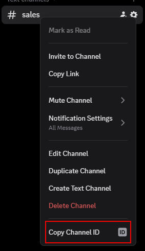

# Configuration Guide

Welcome to the configuration guide for the Payhip Sales Integration Bot! This guide will walk you through every step required to set up and customize your bot for your Discord server and Payhip account. Each section below explains the available configuration options, their purpose, and how to adjust them for your needs.

---

## Overview

The bot uses a single configuration file (`src/config/config.json`) to control all its behavior. You can edit this file directly or use the `/config` command in Discord (admin only) for live updates. For first-time setup, start with the provided `template.config.json` and adjust values as needed.

---

## Configuration File Structure

Here is an example configuration file:

```json
{
  "discordConfig": {
    "botActivity": "Redon.Tech | Payhip Integration",
    "salesChannelId": "YOUR_SALES_CHANNEL_ID",
    "refundsChannelId": "YOUR_REFUNDS_CHANNEL_ID",
    "subscriptionsChannelId": "YOUR_SUBSCRIPTIONS_CHANNEL_ID"
  },
  "payhipConfig": {
    "eventTypes": {
      "newSale": true,
      "refund": true,
      "subscriptions": true
    }
  },
  "databaseConfig": {
    "maxSales": 200
  },
  "webhookConfig": {
    "webhookPort": 3010,
    "webhookPath": "/webhook/payhip",
    "webhookURL": "http://yourdomain.com/webhook/payhip"
  },
  "embedColors": {
    "newSale": "#00FF00",
    "refund": "#FF0000",
    "subscription": "#0000FF"
  }
}
```

---

## Section-by-Section Breakdown

### 1. `discordConfig`

Controls how the bot interacts with Discord.

| Key                   | Description                                      | Example Value                |
|-----------------------|--------------------------------------------------|-----------------------------|
| `botActivity`         | Status message shown under bot name              | `Redon.Tech | Payhip Integration` |
| `salesChannelId`      | Channel ID for sales notifications               | `123456789012345678`        |
| `refundsChannelId`    | Channel ID for refund notifications              | `123456789012345678`        |
| `subscriptionsChannelId` | Channel ID for subscription notifications      | `123456789012345678`        |

> 

**How to find Channel IDs:**
1. Enable Developer Mode in Discord (User Settings > Advanced > Developer Mode).
2. Right-click your target channel and select "Copy Channel ID".

---

### 2. `payhipConfig`

Controls which Payhip events the bot listens for.

| Key         | Description                        | Example Value |
|-------------|------------------------------------|--------------|
| `eventTypes`| Object with event toggles          | `{ "newSale": true, "refund": true, "subscriptions": true }` |

Set each event type to `true` to enable notifications, or `false` to disable.

---

### 3. `databaseConfig`

Controls database-related settings.

| Key       | Description                                 | Example Value |
|-----------|---------------------------------------------|--------------|
| `maxSales`| Maximum number of sales records to keep      | `200`        |

This limits the number of sales stored in the database. Older records are cleaned up automatically.

---

### 4. `webhookConfig`

Controls the webhook server that receives Payhip events.

| Key           | Description                                 | Example Value                  |
|---------------|---------------------------------------------|-------------------------------|
| `webhookPort` | Port number for webhook server              | `3010`                        |
| `webhookPath` | Path for webhook endpoint                   | `/webhook/payhip`             |
| `webhookURL`  | Public URL for Payhip to send webhooks      | `http://yourdomain.com/webhook/payhip` |

> 

**How to set up Payhip Webhooks:**
1. Go to Payhip Dashboard > Account > Webhooks.
2. Add your bot's public webhook URL.
3. Select the events you want to send (Sale, Refund, Subscription).

---

### 5. `embedColors`

Customize the color of Discord embeds for each event type.

| Key           | Description                      | Example Value |
|---------------|----------------------------------|--------------|
| `newSale`     | Color for new sale notifications | `#00FF00`    |
| `refund`      | Color for refund notifications   | `#FF0000`    |
| `subscription`| Color for subscription events    | `#0000FF`    |

Use any valid hex color code. This helps visually distinguish event types in Discord.

> 

---

## Editing Configuration

You can edit the configuration file directly, or use the `/config` command in Discord for live updates (admin only).

### Editing via File
1. Open `src/config/config.json` in your editor.
2. Change values as needed.
3. Save the file. The bot will reload config automatically if supported, or restart the bot.

### Editing via Discord Command
Use the `/config set section key value` command. For example:

```
/config set discordConfig botActivity "Payhip Sales Bot"
/config set webhookConfig webhookPort 3010
```

> 

---

## Troubleshooting

- **Bot not updating config?** Make sure you have permission and the bot is running the latest code.
- **Webhook not working?** Double-check your webhook URL and port, and ensure your server is accessible from the internet.
- **No notifications?** Check your channel IDs and event toggles.

---

## Advanced Tips

- Use environment variables for sensitive data if deploying in production.
- Keep a backup of your config file before making major changes.
- Review the [code-style guide](../dev/code-style.md) for best practices.

---

> **Need help?** Join our [Discord support server](https://discord.gg/Eb384Xw).

---