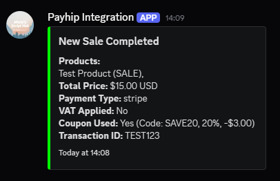

# Webhook Integration

The Integrations Bot uses a webhook to connect your Payhip account to your Discord server. This allows you to receive real-time notifications for sales, refunds, and subscription events directly in your Discord channels.

## How It Works

1. **Payhip Event**: A customer makes a purchase, requests a refund, or starts/cancels a subscription on your Payhip store.
2. **Webhook Triggered**: Payhip sends a POST request to your configured webhook URL (see [Setup Guide](setup.md)).
3. **Bot Receives Event**: The bot's Express server receives the event at the `/webhook/payhip` endpoint.
4. **Event Processing**: The bot parses the event, updates the database, and posts a formatted embed in the appropriate Discord channel.


## Supported Events

- **Sale Completed** (`paid`)
- **Refund Issued** (`refunded`)
- **Subscription Created** (`subscription.created`)
- **Subscription Canceled** (`subscription.deleted`)

Other event types may be ignored or logged for future use.

## Example Event Flow

1. **Customer buys a product on Payhip**
2. Payhip sends a `paid` event to your webhook URL
3. The bot receives the event and posts a "New Sale Completed" embed in your sales channel



## Security Notes

- The bot ignores test payloads (signature starts with `test`)
- Only events from your configured webhook URL are processed
- Make sure your webhook URL is kept private if possible

## Customization

You can customize which events are sent, the embed colors, and the Discord channels in your `config.json` file:

```json
{
	"discordConfig": {
		"salesChannelId": "...",
		"refundsChannelId": "...",
		"subscriptionsChannelId": "..."
	},
	"embedColors": {
		"newSale": "#00FF00",
		"refund": "#FF0000",
		"subscription": "#0000FF"
	},
	"payhipConfig": {
		"eventTypes": {
			"newSale": true,
			"refund": true,
			"subscriptions": true
		}
	}
}
```

---

For setup instructions, see [Webhook Setup](setup.md). For command usage, see [Commands](../commands/sales.md).
