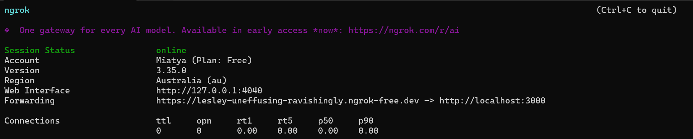

# Webhook Setup

This guide will walk you through setting up the Payhip webhook integration for the Integrations Bot. Follow each step carefully to ensure your sales, refunds, and subscriptions are delivered to your Discord server in real time.

## 1. Configure Your Bot

Before setting up the webhook, make sure your bot is configured and running. You should have already completed the steps in [Getting Started > Configuration](../get-started/configuration.md).

**Key config section:**

```json
{
	"webhookConfig": {
		"webhookPort": 3000,
		"webhookPath": "/webhook/payhip",
		"webhookURL": "http://yourdomain.com/webhook/payhip"
	}
}
```

> **Note:** The `webhookURL` should be accessible from the public internet if you want Payhip to reach your bot. If you are testing locally, use a tool like [ngrok](https://ngrok.com/) to expose your local server.

## 2. Start the Bot

Run the bot using:

```sh
npm start
```

or for development with auto-reload:

```sh
npm run dev
```

The bot will start an Express server and listen for incoming webhook events on the configured port and path.

## 3. Expose Your Webhook (Local Testing)

If you are running the bot locally, you need to expose your webhook endpoint to the internet. The easiest way is to use [ngrok](https://ngrok.com/):

```sh
ngrok http 3000
```

This will give you a public URL (e.g., `https://abc123.ngrok.io/webhook/payhip`). Use this as your webhook URL in Payhip.



## 4. Set Up the Webhook in Payhip

1. Log in to your Payhip dashboard.
2. Go to **Account > Settings > Webhooks**.
3. Click **Add Webhook**.
4. Enter your webhook URL (from your config or ngrok) in the **Webhook URL** field.
5. Select the events you want to receive (recommended: all sales, refunds, and subscriptions).
6. Save the webhook.


## 5. Test the Webhook

You can test your webhook setup using the `/test` command in Discord:

```
/test type:paid
```

Or by making a real purchase/refund on Payhip. The bot will log incoming events and post them to the configured Discord channels.

## 6. Troubleshooting

- Make sure your bot is running and accessible from the internet.
- Check your config for correct `webhookPort`, `webhookPath`, and `webhookURL`.
- If using ngrok, ensure it is running and the URL matches what you set in Payhip.
- Check the bot logs for errors (see the `logs/` directory).
- Ensure your Discord channel IDs are set in the config and the bot has permission to post in those channels.

---

For advanced configuration, see [Configuration](../get-started/configuration.md) and [Database](../database/config.md).

> **Need help?** Join our [Discord support server](https://discord.gg/Eb384Xw).
